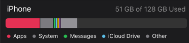
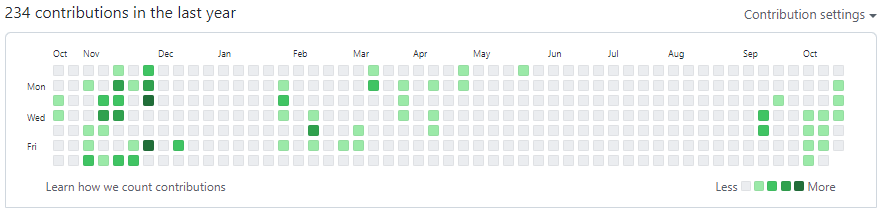
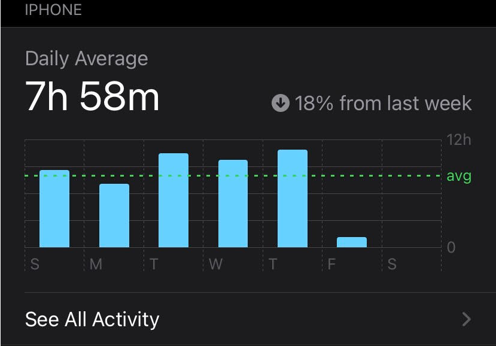
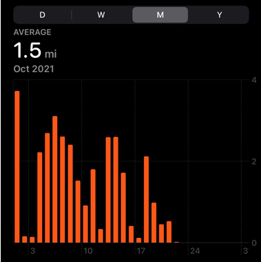
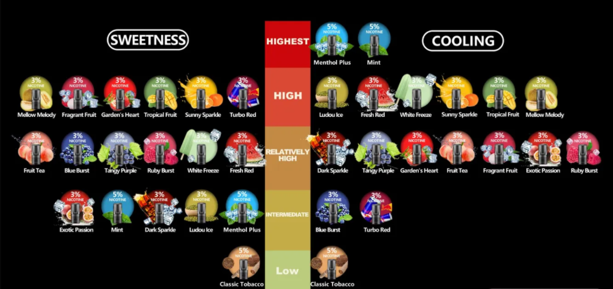

```{r setup, include=FALSE}
knitr::opts_chunk$set(echo = TRUE)
library(tidyverse)
library(ggplot2)
library(ggrepel)
```


# 1) Describe four graphics

### For each graph, provide a description/explanation of its context
- Where does it come from?
– What is the data—individuals & variable(s)—behind the graph?
– Is there a time period associated to it?
– What is the type of graphic (e.g. barchart, piechart, timeline, histogram, map,
heatmap, etc)?

### Describe what color scheme (if any) is being used

### Taking into account the so-called “data ink ratio” concept, explain whether each
graphic seems to be maximizing this ratio or not.

### Describe the things that you find interesting about your graphs.
– Is it the colors?
– Is it the visual appearance?
– Is it the way in which data has been encoded graphically?
– Is there anything that catches your attention?

### Which graph is the one you find the most interesting? And why?


1)
```{r out.width='100%', echo=TRUE, fig.align='left', fig.cap="hi"}

```
- This simple barchart came from iPhone storage underm general settings. Each entry represents the storage taken by specific category. Time is not associated with the graph. It uses few discrete color schemes with each representing each category.

2)
```{r out.width='50%', echo=TRUE, fig.align='left', fig.cap="hi"}

```
- This heatmap graph came from software version control website 'github.com'. This represents how much work(number of commits) did I contribute for each day over the last year. As you can see, time is associated since each entry represents the number of commits in a day. Gray(low) to green(high) color scheme is used to represent the number range.

3)
```{r out.width='50%', echo=TRUE, fig.align='left', fig.cap="hi"}

```
- This barchart came from iPhone Screen Time under Settings. This represents the time spent on screen per day over a week. The time is associated to the graph, both x and y axes. Color is used for the line indicating the average on-screen time, and for the bars to highlight.

4)
```{r out.width='50%', echo=TRUE, fig.align='left', fig.cap="hi"}

```

- This barchart came from a function from iPhone health app, which tracks the walking distance done in a day over a month. Each bar represents the walking distance, and time is associated with x axis. Since background is black, bar should be highlighted for contrast. Other than that, no other color has been used.


### Data Ink ratio
- The first bar chart graph used relatively high ink-ratio, contains with some unnecessary colors. The second heat map graph uses seems to maximize this ratio, since heatmap requires various colors for data to belong to one of the color groups. The third bar chart used relatively low ink-ratio, since it used an additional color to represent the average line. The fourth bar chart seems to maximize this ratio, since it needs two colors at the most to fully represent the data, and it did so.

### Others
- The main reason I choose those four is that those were visually attractive while it effectively shows the purpose/meaning of the graph. Except for the color scheme shown in the first graph, those graphs are simple, and can see what's going on with the data. Among the four, I found the heatmap graph most impressive: the way they visualize the number of commits as a color brightness. It is not only visually attractive, but also incorporate relatively more data into one graph with effective manner.

# 2) Replicate a Graph
- I pick the heatmap graph from github to replicate it.
```{r}
year_month = c(rep("Oct", 8), rep("Nov", 30), rep("Dec", 31),
               rep("Jan", 31), rep("Feb", 28), rep("Mar", 31),
               rep("Apr", 30), rep("May", 31), rep("Jun", 30),
              rep("Jul", 31), rep("Aug", 31), rep("Sep", 30),
              rep("Oct", 22))
year_day = c(c(24:31), c(1:30), c(1:31),
             c(1:31), c(1:28), c(1:31),
               c(1:30), c(1:31), c(1:30),
               c(1:31), c(1:31), c(1:30),
               c(1:22))

# commit numbers are initialized random
probs = c(.6, rep(.04, 10))
commit = sample(0:10, 364, replace=TRUE, prob = probs)

#create day counter
day_counter = c(0:363)

#Create table
dat = data.frame(month = year_month, day = year_day, commit = commit, day_counter)

#add week_counter column using day_counter to arrange y = 7
dat = dat %>%
  mutate(week_counter = day_counter %/% 7 + 1)
dat$y_axis = rep(1:7, 52)
```

-create plot
```{r}
plot = ggplot(dat, aes(x=week_counter, y=y_axis)) + 
  geom_tile(aes(fill=commit), color = 'white') + 
  scale_fill_continuous(low = "#ededed", high = "#10570a") +
  coord_fixed() + 
  theme_classic() + 
  labs(title = "234 contributions in the last year", y="", x="")
  
plot
```

# 3) Find a bad plot

```{r out.width='50%', echo=TRUE, fig.align='left', fig.cap="hi"}

```

- This double sided stem-leaf graph came from the electronic cigarette website 'kissyvape.com'. It divides various flavors by two categories: sweetness and cooling, and categorizes each by its intensity. Time period is not associated to this. green(low) to red(high) color scheme represents the intensity(along with the y-axis). The graph is hard to read, and each entry also has a nicotine containment percentage within it, which adds one more dimension we need to interpret. It clearly obeys rule 2 from Wainer's article: 'Hide What Data You Do Show(Minimize the Data-Ink Ratio)', since the there are too many unnecessary color schemes and unrelated extra dimension to interpret.

# 4) Improving the bad plot
- Since the message of the graph is which flavor has what degree of categorized aspects, it's better to be visualized in 2d plot, each point labeled with the flavor's name. There aren't too many data points(<20) and all are redundant in both side.

```{r}
name = c("strawberry", "blueberry", "mint", "fruit_tea",
"purple", "fresh_red", "tropical", "lemon", "turbo_red", "sparkle")
sweetness = c(4, 3, 1, 2, 3, 3, 4, 3, 3, 4)
cooling = c(2, 3, 5, 2, 3, 4, 2, 4, 2, 4)

entries = data.frame(name = name, sweetness = sweetness, cooling = cooling)
#entries

ggplot(entries, aes(x= sweetness, y= cooling, color=name, label=name))+
  geom_point() +
  geom_text_repel(aes(label=name))
```